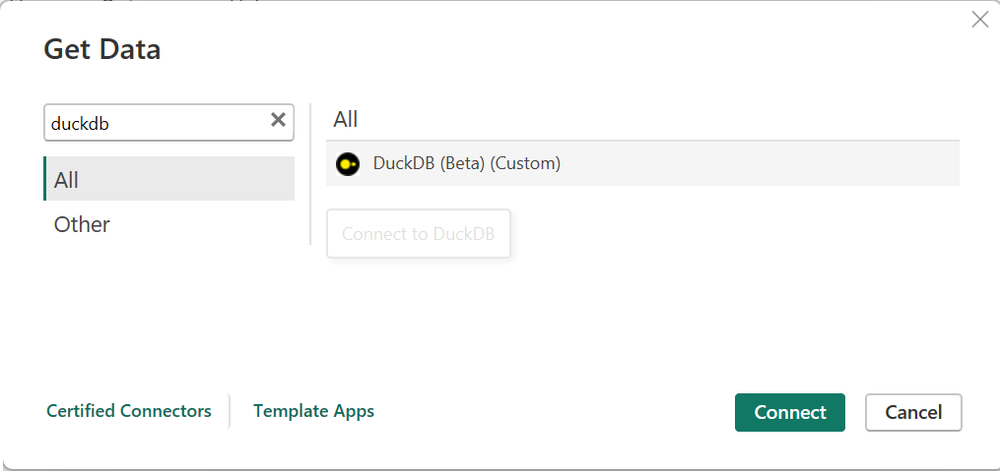
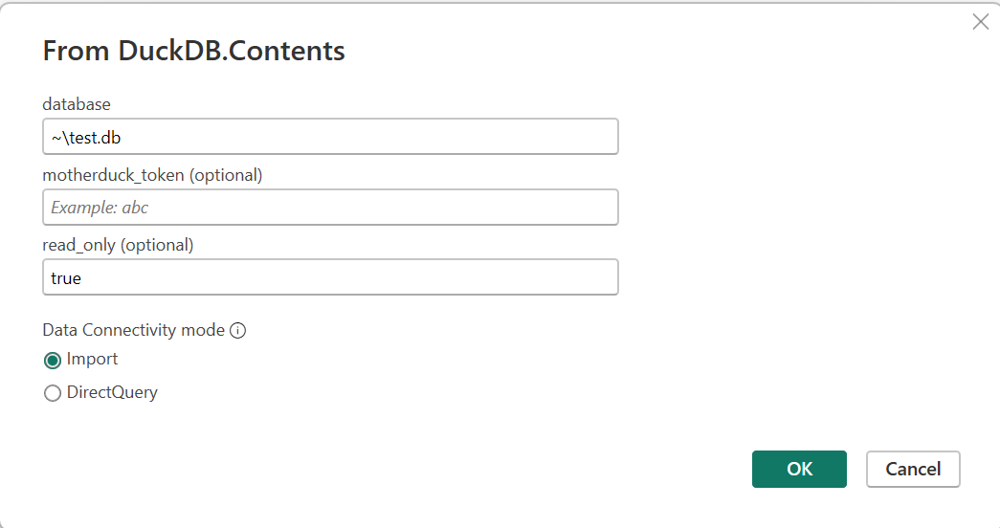
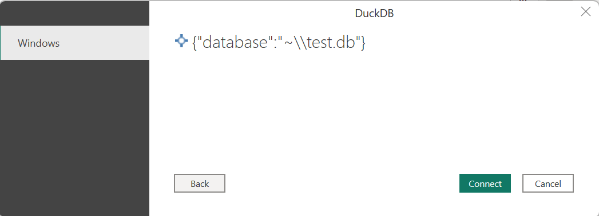

# DuckDB Power Query Connector by MotherDuck (Beta)

This is the Power Query Custom Connector for DuckDB. Use this to connect to a DuckDB database in memory, from a local file or on MotherDuck with Power BI and Excel.

## Installing (Beta version)

1. Install the [DuckDB v0.10.0](https://github.com/duckdb/duckdb/releases/tag/v0.10.0) ODBC driver for your platform:
      - [duckdb_odbc-linux-aarch64.zip](https://github.com/duckdb/duckdb/releases/download/v0.10.0/duckdb_odbc-linux-aarch64.zip)
      - [duckdb_odbc-linux-amd64.zip](https://github.com/duckdb/duckdb/releases/download/v0.10.0/duckdb_odbc-linux-amd64.zip)
1. Create this folder if it does not yet exist: `[Documents]\Power BI Desktop\Custom Connectors`
1. Open Power BI, go to File -> Options and settings -> Options -> Security -> Data Extensions. Enable "Allow any extensions to load without validation or warning".

1. Download and copy the latest `.mez` file from [GitHub Releases](https://github.com/MotherDuck-Open-Source/DuckDBPowerQueryConnector/releases) into this folder.

## How to use with Power BI

1. Click on Get Data -> More...
1. Search for `DuckDB` and click "Connect"

1. Enter your database location. This can be `memory`, a local file path or a MotherDuck database location, e.g. `md:my_database`. (Optional) enter your [MotherDuck token](https://motherduck.com/docs/authenticating-to-motherduck/#authentication-using-a-service-token).
. Click "OK".
1. Click "Connect".

1. Select the table(s) you want to import. Click "Load".

1. You can now query your data and create dashboards!

