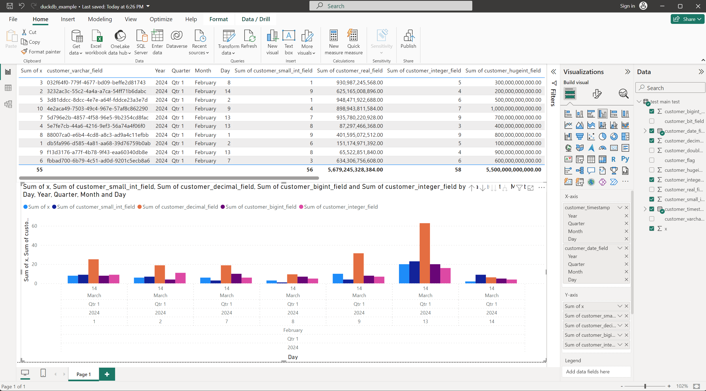

# DuckDB Power Query Connector by MotherDuck

This is the Power Query Custom Connector for DuckDB. Use this to connect to a DuckDB database in memory, from a local file or on MotherDuck with Power BI and Excel.

## Installing

1. Download the latest DuckDB ODBC driver from the [DuckDB Power Query Connector GitHub Releases](https://github.com/MotherDuck-Open-Source/duckdb-power-query-connector/releases) for Windows:
      - [duckdb_odbc-windows-amd64.zip](https://github.com/MotherDuck-Open-Source/duckdb-power-query-connector/releases/latest/download/duckdb_odbc-windows-amd64.zip)
1. Extract the `.zip` archive into a permanent location, such as `C:\Program Files\duckdb_odbc`, and install the latest DuckDB driver by running `odbc_install.exe`.
1. Check that the correct version was installed. To do this, open the Registry Editor by running `regedit` in the command prompt or `Run` dialog. Browse to the `HKEY_LOCAL_MACHINE\SOFTWARE\ODBC\ODBCINST.INI\DuckDB Driver` entry and check that the Driver field contains the version you installed. If not, delete the `DuckDB Driver` registry key and rerun the installer.

1. Open Power BI, go to File -> Options and settings -> Options -> Security -> Data Extensions. Enable "Allow any extensions to load without validation or warning".

1. Download the latest version of the DuckDB Power Query extension:
      - [duckdb-power-query-connector.mez](https://github.com/MotherDuck-Open-Source/duckdb-power-query-connector/releases/latest/download/duckdb-power-query-connector.mez)

1. Create this folder if it does not yet exist: `[Documents]\Power BI Desktop\Custom Connectors`.

1. Move or copy the `duckdb-power-query-connector.mez` file into `[Documents]\Power BI Desktop\Custom Connectors`. Note that if this location does not work, you may need to place this in your OneDrive Documents folder.

## How to use with Power BI

1. Click on Get Data -> More...
1. Search for `DuckDB` and click "Connect"

1. Enter your database location. This can be a local file path (e.g. `~\my_database.db`) or a MotherDuck database location (e.g. `md:my_database`). (Optional) enter your [MotherDuck token](https://app.motherduck.com/token-request?appName=PowerBI). If you want to access the database in `read_only` mode, you can set it to `true`.

Click "OK".
1. Click "Connect".

1. Select the table(s) you want to import. Click "Load".

1. You can now query your data and create visualizations!

